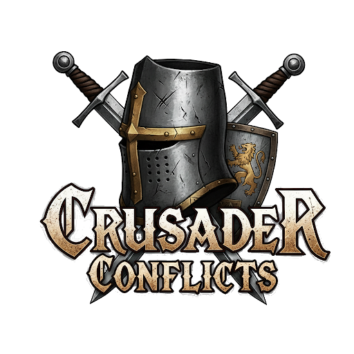

# What is Crusader Conflicts?
Crusader Conflicts revolutionizes the Crusader Kings 3 warfare experience by seamlessly integrating the epic, real-time battles of Total War: Attila. Lead your armies on the grand strategy map of CK3, then command them directly on the battlefields of Attila in massive, 1:1 scale conflicts.
This project builds upon the foundational concepts of the original Crusader Wars mod, expanding and refining its vision for a new generation of players.

# Current features:
- **Epic Land Battles** Engage in massive, 1:1 scale land battles from Crusader Kings 3 directly within Total War: Attila, experiencing every strategic and tactical detail.
- **Persistent Consequences** Battle outcomes are meticulously calculated, with every casualty accurately reflected in your Crusader Kings 3 save file, ensuring your decisions on the battlefield have lasting impact.
- **Dynamic Unit Rosters** Experience historically authentic warfare with unit rosters dynamically mapped from CK3 cultures, heritages, and Men-at-Arms to a curated collection of Total War: Attila mods, spanning the 8th to 15th centuries.
- **Unique Levy Compositions** Discover the distinct fighting styles of each culture and heritage through their unique levy compositions, ranging from infantry-heavy formations to cavalry-focused forces, making every battle feel unique.
- **Cultural Diversity on the Battlefield** Witness the rich cultural tapestry of Crusader Kings 3 reflected in Total War: Attila, as each regiment's origin culture influences its appearance and fighting style.
- **Commanders Matter** Your army's commander takes the field as a Total War general, with their noble rank, personal prowess, and martial skill directly influencing their unit's strength, experience, and the quality of defensive deployables.
- **Valiant Knights** Individual knights from your court are represented as powerful units, their prowess and martial skills directly enhancing their combat effectiveness. The overall knight effectiveness of their lord further boosts their unit's experience, with their cultural identity shaping their appearance.
- **Legendary Acclaimed Knights** Acclaimed Knights stand out with increased soldier counts and unique special abilities for their units, derived from their accolades and glory rank, turning the tide of battle.
- **Real Stakes, Real Danger** The consequences of battle extend beyond the field: generals and knights can be injured, captured, or even killed. Characters fighting with injuries will suffer penalties to their unit's strength, adding a layer of personal risk to every engagement.
- **Dynamic Terrain Generation** Battle maps in Total War: Attila are dynamically generated based on the Crusader Kings 3 terrain, ensuring defending armies always gain the strategic advantage of high ground in mountainous or hilly regions.
- **Historically Inspired Battlefields** Engage in battles on unique maps that reflect the special buildings present in the province where the conflict takes place, adding historical flavor to each encounter.
- **Atmospheric Weather Effects** The in-game month influences the battle's weather, creating an immersive seasonal atmosphere. Increased winter severity in CK3 translates to harsher winter conditions and effects on the Total War battlefield.
- **Seamless Integration** Launch Total War: Attila with the correct mods and battle setup at the press of a button. After the battle, the edited save file is automatically compressed and re-integrated into Crusader Kings 3 for lightning-fast loading.
- **Built-in Attila Mod Manager** Easily manage and enable/disable required and optional Total War: Attila mods directly from the Crusader Conflicts options menu.
# Roadmap
Here you can see all our concepts, ideas, and plans for the mod.
[Join our Discord to see the roadmap and discuss the mod!](https://discord.gg/X64pMysa)
# -------------------How does it work?---------------------
If you want to code a mod like this, these are the major steps to achieve it:
## Crusader Kings 3 Data Output:
Crusader Conflicts retrieves data from Crusader Kings 3 through two primary methods: Console Commands and direct Save File parsing. A custom CK3 mod provides a button on the window_combat.gui. When activated, this button generates a save file and executes console commands that output crucial battle data, which the Crusader Conflicts application then reads from the console_history.txt file located in your Documents\Paradox Interactive\Crusader Kings III\ folder.

## Crusader Kings 3 Data Reading:
Crusader Conflicts primarily reads 80% of its data directly from the CK3 save file, with the remaining information extracted from the console_history.txt file.
On the Save File, it reads data from these sections (in order):
- combats
- traits_lookup
- armies
- units
- army_regiments
- regiments
- landed_titles
- counties
- mercenary_company_manager
- living
- accolades
- court_positions
- culture_manager

On the console_history.txt it gets this data, which is: 
- Year and Month
- Battle Name
- Left & Right Realm Names
- User Character ID and Culture ID
- Left & Right Main Participants Character ID and Culture ID
- Left & Right Commanders Character ID, Culture ID, Martial Value, Prowess Value, and Feudal Rank
- Left & Right Knights Character ID, Names and Prowess Value
- Knights Effectiveness
- Terrain Type
- Province ID
- Winter Severity
- Special Building in the Holding
- Left & Right Advantages Modifiers
- KEYWORD, for the app to detect a battle has started
```
Log.ClearAll
DateYear:936
DateMonth:12
BattleName:Battle of Zürich
T Your E TOOLTIP:GAME_CONCEPTrealm Realm: ONCLICK:TITLE982 TOOLTIP:LANDED_TITLE982 L Kingdom of Germany
T Enemy E TOOLTIP:GAME_CONCEPTrealm Realm: ONCLICK:TITLE7186 TOOLTIP:LANDED_TITLE7186 L Kingdom of Burgundy
PlayerCharacter_ID:12185
PlayerCharacter_Culture:36
LeftSide_Owner_ID:12185
LeftSide_Owner_Culture:36
RightSide_Owner_ID:10874
RightSide_Owner_Culture:37
---------Player Army---------
LeftSide_Commander_Culture:41
T Commander E TOOLTIP:GAME_CONCEPTadvantage Advantage: 23
Martial skill: positive_value 23
PlayerProwess:3
PlayerRank:3
ONCLICK:CHARACTER11796 TOOLTIP:CHARACTER11796 L high Margrave high Gero: 18 E TOOLTIP:GAME_CONCEPTprowess Prowess
ONCLICK:CHARACTER12148 TOOLTIP:CHARACTER12148 L high Lord-Mayor high Adam: 18 E TOOLTIP:GAME_CONCEPTprowess Prowess
ONCLICK:CHARACTER9936 TOOLTIP:CHARACTER9936 L high Duke high Dirk: 12 E TOOLTIP:GAME_CONCEPTprowess Prowess
ONCLICK:CHARACTER11292 TOOLTIP:CHARACTER11292 L high Count high Amadeus: 12 E TOOLTIP:GAME_CONCEPTprowess Prowess
ONCLICK:CHARACTER12452 TOOLTIP:CHARACTER12452 L high Prince high Heinrich: 9 E TOOLTIP:GAME_CONCEPTprowess Prowess
ONCLICK:CHARACTER19917 TOOLTIP:CHARACTER19917 L high Mayor high Eggerd: 9 E TOOLTIP:GAME_CONCEPTprowess Prowess
ONCLICK:CHARACTER12175 TOOLTIP:CHARACTER12175 L high Duke high Hermann: 8 E TOOLTIP:GAME_CONCEPTprowess Prowess
x
---------Enemy Army---------
RightSide_Commander_Culture:209
T Commander E TOOLTIP:GAME_CONCEPTadvantage Advantage: 17
Martial skill: positive_value 17
EnemyProwess:7
EnemyRank:3
ONCLICK:CHARACTER11822 TOOLTIP:CHARACTER11822 L high Count high Charles-Constantin: 19 E TOOLTIP:GAME_CONCEPTprowess Prowess
ONCLICK:CHARACTER12618 TOOLTIP:CHARACTER12618 L high Count high Heinrich: 13 E TOOLTIP:GAME_CONCEPTprowess Prowess
ONCLICK:CHARACTER11529 TOOLTIP:CHARACTER11529 L high Count high Rotbold: 9 E TOOLTIP:GAME_CONCEPTprowess Prowess
ONCLICK:CHARACTER12484 TOOLTIP:CHARACTER12484 L high Count high Conrad: 8 E TOOLTIP:GAME_CONCEPTprowess Prowess
ONCLICK:CHARACTER12485 TOOLTIP:CHARACTER12485 L high Count high Artôd: 7 E TOOLTIP:GAME_CONCEPTprowess Prowess
ONCLICK:CHARACTER20546 TOOLTIP:CHARACTER20546 L high Mayor high Dietmar: 7 E TOOLTIP:GAME_CONCEPTprowess Prowess
ONCLICK:CHARACTER25894 TOOLTIP:CHARACTER25894 L high Acfred: 7 E TOOLTIP:GAME_CONCEPTprowess Prowess
From Train Commanders: TOOLTIP:GAME_CONCEPTknight_i knight_iconP 3%
---------Completed---------
TOOLTIP:TERRAINplains L Plains
Region:Europe
ProvinceID:2051
Mild
Continental European
PlayerID:11230
EnemyID:12485
PlayerName:Count Meginhard II of Zutphen
EnemyName:Count Artôd of Lyon
SpecialBuilding:
---------Modifiers---------
T E TOOLTIP:GAME_CONCEPTadvantage Advantage: P 11 in your favor
Your damage is increased by V 22%

Our Advantage: positive_value 33indent_newline:3 
Commander E TOOLTIP:GAME_CONCEPTmartial_skill Martial Skill: positive_value 23indent_newline:3 
E TOOLTIP:GAME_CONCEPTcombat_roll Battle Roll: positive_value 10

Their Advantage: positive_value 22indent_newline:3 
Commander E TOOLTIP:GAME_CONCEPTmartial_skill Martial Skill: positive_value 17indent_newline:3 
E TOOLTIP:GAME_CONCEPTcombat_roll Battle Roll: positive_value 5
Keyword:CRUSADERWARS3
```

## Total War: Attila Data Input
Leveraging all collected data, Crusader Conflicts generates a historical battle .pack file for Total War: Attila, utilizing the Rusted PackFile Manager (RPFM). For those interested in the technical details, the process of inserting data into the .pack file is similar to the methods outlined in this tutorial, which guided the early development of this mod: https://www.twcenter.net/forums/showthread.php?815366-Scripted-Historical-Battles
This `.pack` file contains all the necessary information to recreate the CK3 battle in Attila, including unit rosters, army compositions, deployment positions, and custom scripts.

### Battle Execution and Result Processing
Once the battle pack is generated, the application launches Total War: Attila with a specific set of command-line arguments. This ensures that all required mods are enabled and that the game loads directly into the custom historical battle. While the player commands their forces on the battlefield, Crusader Conflicts monitors Attila's log files in the background, waiting for the battle to conclude.

### Applying Battle Outcomes to Crusader Kings 3
After the battle ends, the application parses the Attila log file to determine the outcome. It meticulously calculates casualties for every regiment, tracks kills for knights and commanders, and notes if any characters were killed or wounded. This data is then used to modify the original CK3 save file:
- **Regiment Strength:** The number of soldiers in each CK3 regiment is updated to reflect the exact casualties sustained in the Attila battle.
- **Character Fates:** If a commander or knight is killed, their character is marked as deceased in the save file. Wounds are also applied based on events and user-defined probabilities.
- **Combat Resolution:** The in-game combat in CK3 is resolved based on the Attila battle's outcome, determining the winner and loser.

Finally, the modified save file data is re-compressed into a new `.ck3` file and placed in your save games folder. The application then seamlessly returns you to Crusader Kings 3 to continue your campaign, with all the consequences of your tactical decisions on the battlefield now permanently reflected in the grand strategy layer.
